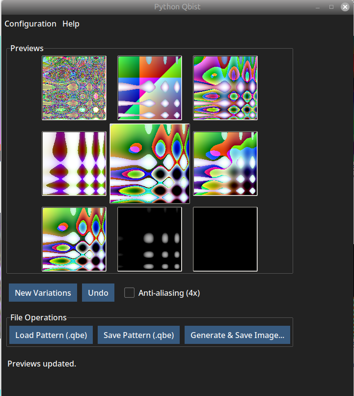

# Python Qbist

Python Qbist is a graphical application for creating and manipulating Qbist patterns, inspired by the original GIMP Qbist plugin and the algorithm by Jörn Loviscach (c't 10/95). This tool allows you to generate algorithmic art, explore variations, and export your creations as images or pattern files.



## Features

- Generate unique Qbist patterns using a random algorithm
- Create new variations and undo changes
- Save and load patterns (`.qbe` files)
- Export images in PNG or JPEG format
- Customizable output directories and default image sizes
- Multilingual support (English, German)
- Modern UI with theme selection (using ttkbootstrap)
- About dialog with project information

## Installation

### Requirements

- Python 3.8 or newer
- [Pillow](https://python-pillow.org/) (`pip install pillow`)
- [ttkbootstrap](https://ttkbootstrap.readthedocs.io/) (`pip install ttkbootstrap`)
- [toml](https://pypi.org/project/toml/) (`pip install toml`)
- [numpy](https:)  (`pip install numpy`)
- [numba] (`pip install numba`)

### Setup

1. **Clone the repository:**
   ```sh
   git clone https://github.com/yourusername/python-qbist.git
   cd python-qbist
   ```

2. **Install dependencies:**
   ```sh
   pip install pillow ttkbootstrap toml
   ```

3. **(Optional) Set up translations:**
   - Translations for English and German are included in the `locale/` directory.
   - You can add or update translations using standard gettext tools.

4. **Run the application:**
   ```sh
   python qbist_app.py
   ```

## Usage

- Use the main window to generate new Qbist patterns and explore variations.
- Save your favorite patterns or export them as images.
- Access the menu for configuration, theme selection, and language switching.
- The "About" dialog provides credits and license information.

## License

This project is licensed under the GPLv3. See the `about.md` file for more details.

## Credits

- Original algorithm: Jörn Loviscach (c't 10/95)
- GIMP Qbist plugin: Jens Ch. Restemeier
- Python port and GUI: Thomas Cigolla
- See [about.md](about.md) for full credits.

---
Enjoy experimenting with algorithmic art!

## Performance Improvements (recent)

- Added optional Numba acceleration in `qbist_core.py` to speed up image generation when `numba` is installed.
- Introduced a helper `_expinfo_to_arrays()` that converts `ExpInfo` into primitive NumPy arrays suitable for JIT compilation.
- Implemented Numba-jitted functions:
   - `_calculate_pixel_color_numba(...)` — JIT-compiled replacement for the per-pixel color calculation.
   - `_generate_image_data_numba(...)` — JIT-compiled, `prange`-parallelized image generation and oversampling loop.
- `generate_image_data()` now automatically uses the Numba path if `numba` is available; it falls back to the original pure-Python implementation otherwise. Monochrome detection and other app-level logic remain unchanged.

## How to enable and test Numba acceleration

1. Install Numba in your virtual environment:

```sh
pip install numba
```

2. Run the app normally (`python qbist_app.py`). If Numba is importable the app will use the accelerated path automatically.

3. To measure speedups, run a small benchmark (generate an image at a chosen resolution with different `oversampling` values) and compare timings with and without `numba` installed.

Notes:
- Numba provides large speedups for the heavy per-pixel loops; the first Numba call will compile functions and may take longer on the first run.
- If you encounter issues with Numba on your platform, simply uninstall it to revert to the stable Python implementation.